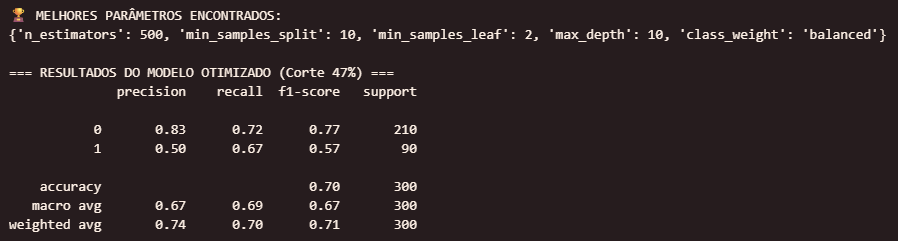
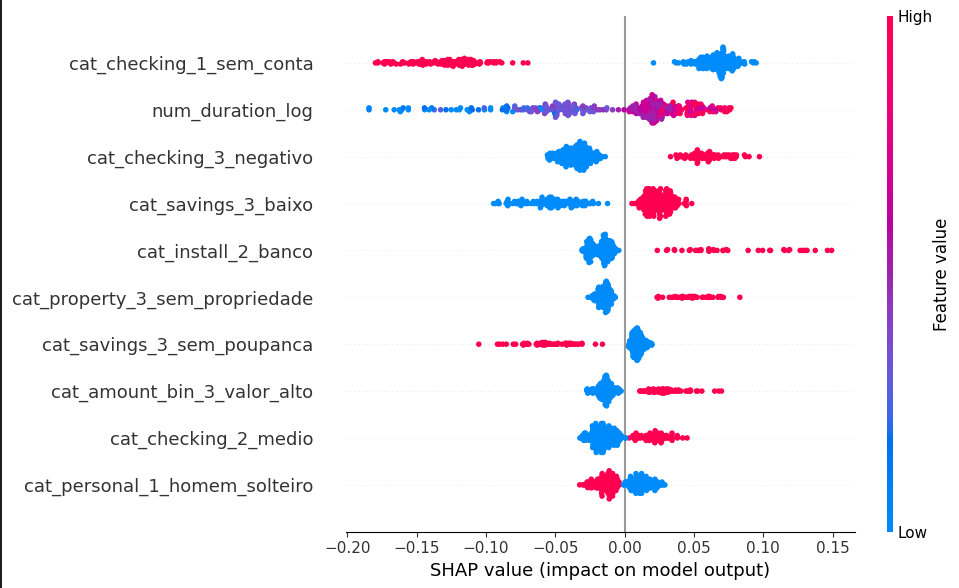

# 🏦 Risco de Crédito: Otimização de Threshold e Explicabilidade

## 📌 O Problema de Negócio
Em operações de crédito, um falso negativo (aprovar um mau pagador) gera prejuízo direto, enquanto um falso positivo (negar um bom pagador) gera perda de receita e atrito comercial. O objetivo deste projeto foi construir um modelo preditivo utilizando o dataset German Credit Data que equilibrasse essa balança, focando na métrica de negócio, não apenas em Acurácia matemática.

## 🔬 Descobertas e Processamento de Dados (EDA & Data Prep)
Um dos maiores desafios de se trabalhar com uma base "pronta", como a *German Credit Data*, não é o seu volume, mas os pequenos detalhes que geram atrito antes mesmo da modelagem. Abaixo detalho os passos críticos:

**1. Padronização e Nomenclatura:**
A primeira dificuldade percebida foi na falta de padronização nas nomenclaturas de variáveis. 
* A variável de *target* se chamava "class" inicialmente. Como boa prática em projetos de modelagem e para evitar conflito com funções nativas (e facilitar a leitura do código), renomeamos ela para `target`.

**2. Variáveis Categóricas e a Matriz de Correlação:**
Muitos tutoriais recomendariam a remoção imediata de variáveis como `cat_checking_1_sem_conta` porque, numa análise simples de matriz de correlação, elas apresentavam coeficientes lineares muito baixos.
* **O Insight de Negócio:** Decidi *não* fazer isso. O risco de crédito raramente tem relações lineares. Mais à frente, durante a fase de explicabilidade (SHAP), essa decisão se provou acertada, pois o modelo encontrou padrões vitais nessa *feature* não linear. 

**3. O Desbalanceamento Oculto (A Ilusão da Acurácia):**
A distribuição inicial dos dados contava com **70% de bons pagadores** e apenas **30% de maus**.
* Se um modelo classificar aleatoriamente todos os clientes como "Bons", obteríamos 70% de acurácia, mas o banco amargaria prejuízos gigantescos com o risco retido. O desafio era: precisamos ensinar o algoritmo a priorizar a classe com apenas 30% das amostras.
* **Ação Tomada:** Antes da modelagem, optamos por usar o parâmetro `class_weight='balanced'` nas árvores de decisão. Ao invés de usar técnicas complexas de geração de dados sintéticos (como SMOTE) que poderiam introduzir *Overfitting*, optamos por penalizar matematicamente os erros do modelo caso ele "ignorasse" os maus pagadores.

---

## 🛠️ Tecnologias e Ferramentas
* **Linguagem:** Python
* **Bibliotecas:** Pandas, Scikit-Learn, XGBoost, Matplotlib, Seaborn, SHAP
* **Algoritmos Testados:** Random Forest Classifier, XGBoost

## 📊 A Solução e Modelagem (Random Forest vs XGBoost)
Testei dois dos algoritmos mais utilizados na indústria: *Random Forest* e *XGBoost*.

O **XGBoost** demonstrou um problema rápido de *Overfitting* com nossa massa de dados (entregou um Recall inferior, na casa dos 61%). A sensibilidade do algoritmo aos desbalanceamentos o tornou menos prático dado nosso escopo de *Threshold*.

O **Random Forest** tunado, no entanto, foi mais robusto. 
O principal desafio enfrentado não foi o de treinar o modelo, mas de definir o **ponto de corte (Threshold)** ideal:
A maioria dos modelos assume um limite de decisão padrão de 50%. Através de uma análise da curva de Precisão vs. Recall, o ponto de corte ideal (focado no retorno comercial) foi calibrado para **47%**. 

**Impacto Simulado:**
* **Recall de Calotes (Classe 1): 67%** - Protege o caixa do banco e está totalmente alinhado aos padrões da indústria (65%~70%) para bases sem *Data Leakage*.
* **Recall de Bons Pagadores (Classe 0): 72%** - Mantém a aprovação saudável para a área comercial.
* **O Resultado:** O Random Forest se tornou nosso modelo para produção devido à sua robustez neste contexto específico.

## 🔍 Explicabilidade do Modelo (SHAP)
Para garantir a transparência exigida por órgãos reguladores e comitês de risco, o modelo foi dissecado utilizando a teoria dos jogos (SHAP Values).

**Principais Insights:**
1. **Prazo (`num_duration_log`):** Empréstimos mais longos aumentam drasticamente o risco de default.
2. **Status da Conta (`cat_checking_3_negativo`):** Clientes com contas já negativadas são os perfis de maior risco.
3. **Sem Histórico (`cat_checking_1_sem_conta`):** Paradoxalmente, a ausência de uma conta corrente registrada demonstrou reduzir o risco de inadimplência, indicando possível ausência de alavancagem financeira anterior.
   

## 🚀 Como Executar o Projeto
1. Clone este repositório: `git clone [URL_DO_SEU_REPO]`
2. Instale as dependências: `pip install -r requirements.txt`
3. Execute o notebook `[nome_do_seu_notebook].ipynb`
